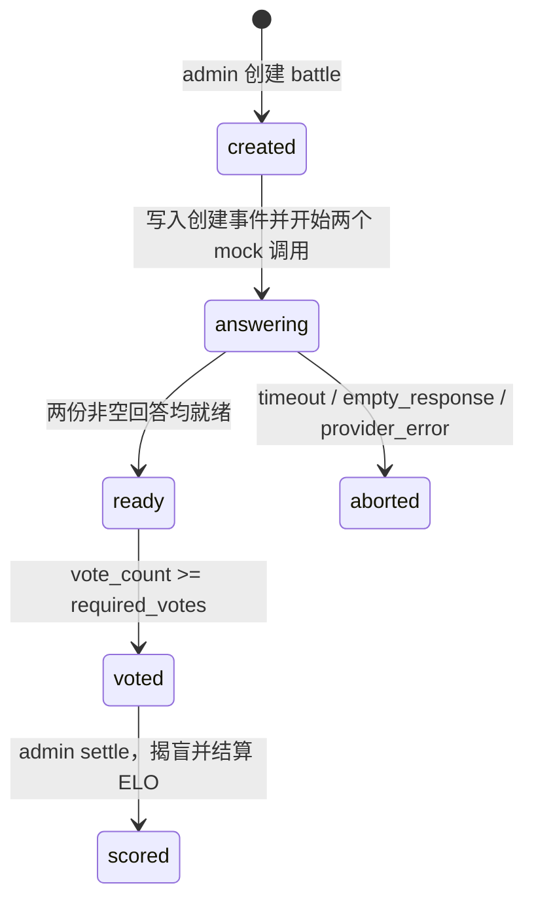

# arena-lite DESIGN v1 - 2510631109

- 文档状态：D07 设计基线，供 D09 拆卡与 D10 测试先行实现使用。
- 设计角色：`architect-2510631109`
- 输入：`docs/PRD.md`、`docs/SPEC.md`、`process/spec-review-2510631109.md`、`AGENTS.md`。
- 范围：M 阶段仅覆盖 US-1（发起对战并盲投）与 US-2（揭盲与排行榜）。
- 当前实现边界：仓库中的 `app/main.py` 目前只有 `GET /health`；本文描述的是后续实现边界和测试入口，不声称业务接口、数据表或测试文件已存在。

## 1. 设计目标与可追溯性

| PRD/SPEC 来源 | 设计落点 | 可验证入口 |
|---|---|---|
| PRD US-1、SPEC AC-1.1 | `api/` 创建 battle，`domain/battle.py` 管理 `created -> answering -> ready` | `pytest tests/test_api_contract.py`、`pytest tests/test_battle_state.py` |
| PRD 匿名规则、SPEC AC-1.2 | `domain/pairing.py` 随机 A/B slot；匿名 DTO 不含身份、ELO、rank | `pytest tests/test_pairing.py`、`pytest tests/test_api_contract.py` |
| PRD 一次盲投、SPEC AC-1.4/1.5 | `domain/battle.py` 检查状态，`storage/` 对 `(battle_id, voter_id)` 施加唯一约束 | `pytest tests/test_battle_state.py`、`pytest tests/test_storage.py` |
| PRD US-2、SPEC AC-2.1/2.4 | `POST /battles/{id}/settle` 是唯一揭盲和 ELO 结算入口 | `pytest tests/test_api_contract.py`、`pytest tests/test_elo.py` |
| SPEC AC-2.2、§7 | `domain/elo.py` 实现纯函数 ELO 计算、半入向上取整和最低分 | `pytest tests/test_elo.py` |
| SPEC ERR-6 至 ERR-8 | `adapters/` 将超时、空回答、提供方异常归一化；`domain/battle.py` 转为 `aborted` | `pytest tests/test_model_adapter.py`、`pytest tests/test_battle_state.py` |
| SPEC ERR-1 至 ERR-10 | API 层统一映射 `401`、`404`、`409`、`422`，失败路径不修改 ELO 或排行榜 | `pytest tests/test_api_contract.py` |

## 2. 模块地图与依赖方向

```text
client/ -> api/ -> domain
                  -> adapters
                  -> storage

domain -> standard library only
adapters -> external model clients
storage -> sqlite
tests -> api/domain/adapters/storage
```

- `api/` 是 HTTP 边界：它负责鉴权、Pydantic 请求校验、调用领域服务及把领域错误转为 HTTP 响应。
- `domain/` 是业务规则边界：它不依赖 FastAPI、SQLite、HTTP 客户端或真实模型提供方。
- `adapters/` 仅处理模型调用适配与标准化结果；它不决定状态机、投票结果或 ELO。
- `storage/` 只保存和读取数据；它不决定哪些状态迁移合法。
- `client/` 只触发 API、展示匿名或已揭盲视图；它不携带 ELO 公式、权限或状态判断。

### 2.1 模块边界

| 模块 | 责任 | 不负责 | 主要测试 | Test entry / command |
|---|---|---|---|---|
| `api/` | FastAPI 路由、本地测试身份、请求/响应 DTO、状态码映射 | ELO 公式、SQLite SQL、真实模型调用细节 | 权限、请求校验、响应体、错误状态码 | `pytest tests/test_api_contract.py` |
| `domain/battle.py` | battle 状态机、投票阈值、非法迁移判断、结算前置条件 | HTTP、数据库连接、模型 SDK | 合法/非法状态迁移、重复操作不变量 | `pytest tests/test_battle_state.py` |
| `domain/elo.py` | expected_a、expected_b、new_a、new_b、半入向上取整、最低分 | 读取 Vote、写入排行、HTTP | 1500 对 1500、不同分差、最低分、胜负守恒 | `pytest tests/test_elo.py` |
| `domain/pairing.py` | A/B 随机位置、自战校验、Vote 幂等前置判断 | 生成模型回答、存储业务状态、接口鉴权 | 随机位置、自战、重复投票边界 | `pytest tests/test_pairing.py` |
| `adapters/` | 统一模型调用契约、超时/空回答/提供方异常分类 | battle 状态决策、ELO、SQLite | mock 成功、超时、空回答、异常 | `pytest tests/test_model_adapter.py` |
| `storage/` | SQLite schema、仓储读写、Vote 唯一约束、StatusEvent 持久化 | 决策业务规则、HTTP 响应格式 | 仓储读写、事务、不写入非法事件 | `pytest tests/test_storage.py` |
| `client/` | 简单 CLI 或页面的 API 调用、匿名/已揭盲结果展示 | 业务规则、身份授权和 ELO 计算 | 主链路冒烟 | `pytest tests/test_client_smoke.py` |
| `tests/` | 固定验收标准、回归和错误路径 | 修改生产逻辑、绕过契约 | 全量回归 | `pytest` |

## 3. 数据模型与存储边界

| 实体 | 关键字段 | 规则 |
|---|---|---|
| User | `id`、`role`、`local_test_token` | 仅预置 `admin`、`voter` 演示身份；`admin` 映射 `local-admin-token`，`voter` 映射 `local-voter-token`；无注册、密码或真实凭据存储。 |
| Contestant | `model_id`、`name`、`elo`、`wins`、`losses`、`draws`、`battles` | 初始 ELO 为 1500；最低为 100；每场 battle 必须是两个不同 Contestant。 |
| Battle | `battle_id`、`prompt`、`contestant_a_id`、`contestant_b_id`、`answer_a`、`answer_b`、`status`、`required_votes`、`vote_count`、`error_message` | `required_votes` 的 M 阶段默认值为 1；`vote_count >= required_votes` 后才可进入 `voted`。 |
| Vote | `vote_id`、`battle_id`、`voter_id`、`choice` | `(battle_id, voter_id)` 唯一；`choice` 只能为 A 或 B。 |
| StatusEvent | `event_id`、`battle_id`、`from_status`、`to_status`、`at`、`reason` | 仅在合法迁移成功后写入；非法迁移返回 409 且不新增事件。 |

`storage/` 在一次合法 settle 中应以同一事务写入：battle 的 `voted -> scored` 状态、StatusEvent、双方 Contestant 的 ELO/统计更新。事务失败时整体回滚，不能出现“已 scored 但未更新分数”或“已改分但仍 voted”。

## 4. API 契约

本节将 D06 的 provisional contract 细化为 D10 可实现的本地测试契约。`POST /login` 只签发脱敏、本地演示 token；它不是注册或真实账号功能。受保护接口使用 `Authorization: Bearer <token>`；该 token 仅映射预置 `admin` 或 `voter` 角色。

| 方法与路径 | 权限 | Request schema | Response schema | 成功响应 | 失败响应 |
|---|---|---|---|---|---|
| `POST /login` | 公开（本地测试） | `{ "role": "admin" | "voter" }` | admin: `{ "token": "local-admin-token", "role": "admin" }`；voter: `{ "token": "local-voter-token", "role": "voter" }` | `200`，返回与角色匹配的本地测试访问凭证 | `401`，role 非法 |
| `POST /battles` | admin | Header: Bearer admin token；Body: `{ "prompt": "...", "contestant_a_id": "...", "contestant_b_id": "..." }` | `{ "battle_id": "...", "status": "answering" }` | `201`，创建后开始两个 mock 调用 | `401`、`422` |
| `GET /battles/{id}` | voter | Path: `{ "id": "..." }`；Header: Bearer voter token | ready: `{ "battle_id": "...", "status": "ready", "question": "...", "answer_a": "...", "answer_b": "...", "vote_count": 0, "required_votes": 1 }`；aborted 时额外返回脱敏失败原因；scored 时额外返回揭盲和 ELO 结果 | `200` | `401`、`404` |
| `POST /battles/{id}/vote` | voter | Header: Bearer voter token；Body: `{ "choice": "A" | "B" }` | `{ "battle_id": "...", "choice": "A" | "B", "vote_count": 1, "required_votes": 1, "status": "voted" }` | `200`，第一次有效投票后进入 `voted`，不揭盲 | `401`、`404`、`409`、`422` |
| `POST /battles/{id}/settle` | admin | Path: `{ "id": "..." }`；Header: Bearer admin token | `{ "battle_id": "...", "reveal": { "answer_a_contestant": "...", "answer_b_contestant": "..." }, "vote_counts": { "A": 1, "B": 0 }, "elo_before": { "...": 1500 }, "elo_after": { "...": 1516 }, "elo_delta": { "...": 16 }, "status": "scored" }` | `200`，揭盲并仅结算一次 | `401`、`404`、`409` |
| `GET /leaderboard` | voter | Header: Bearer voter token；Query: `{ "limit": 20 }` | `{ "items": [{ "rank": 1, "model_id": "...", "name": "...", "elo": 1516, "wins": 1, "losses": 0, "draws": 0, "battles": 1 }] }` | `200`，按 ELO 降序、同分按 model_id 升序 | `401` |

### 4.1 认证、匿名与错误映射

- `admin` 只能创建和 settle；`voter` 只能查看、投票和查看排行榜。缺 token、无效 token、角色不匹配都返回 `401`。
- ready 阶段的 GET 绝不返回 `contestant_a_id`、`contestant_b_id`、`model_id`、`name`、`elo`、`rank` 或可推断身份的元数据。
- 空或超过 2000 字符的 prompt、相同 contestant、非法 choice 返回 `422`。
- 不存在的 battle 返回 `404`。
- 同一 voter 重复投票返回 `409 ALREADY_VOTED_2510631109`；未投票就 settle、对 `aborted` battle 投票、对 `scored` battle 投票或重复 settle 返回 `409 ILLEGAL_STATE_2510631109`。
- 失败路径均不改变 ELO、排行榜、胜负统计；非法迁移也不写入 StatusEvent。

## 5. Battle 状态机



| 当前状态 | 触发操作 | 前置条件 | 后继状态 | 可观察结果 |
|---|---|---|---|---|
| `created` | 创建记录完成 | 两名 Contestant 不同、prompt 合法 | `answering` | 写入 `created -> answering` 的 StatusEvent；开始两个 mock ask。 |
| `answering` | 两份回答成功 | 两份 text 非空且无 provider 错误 | `ready` | 匿名 GET 可返回题目和 A/B 回答。 |
| `answering` | 适配层失败 | timeout、empty_response 或 provider_error | `aborted` | 写入原因；ELO、Vote、榜单不变。 |
| `ready` | 首次有效 vote | voter 未对该 battle 投票；choice 为 A/B | `voted` | `vote_count=1`、`required_votes=1`；响应不揭盲。 |
| `voted` | admin settle | `vote_count >= required_votes` 且尚未结算 | `scored` | 原子更新 ELO、统计与 StatusEvent，并返回揭盲结果。 |

未列出的转换一律不合法并返回 `409`。特别地，低于投票阈值时 battle 保持 `ready`；M 阶段 `required_votes=1`，因此第一次有效投票立即满足 `vote_count >= required_votes`。若将来扩为多票，必须同步修改 SPEC、DESIGN、测试、D10 curl 验收和 UAT。

## 6. ELO 规则

- 初始分：1500；K 值：32；最低分：100。
- 胜者实际得分为 1，负者实际得分为 0；M 阶段不支持 tie。
- `expected_a = 1 / (1 + 10 ** ((rating_b - rating_a) / 400))`。
- `expected_b = 1 / (1 + 10 ** ((rating_a - rating_b) / 400))`，等价于 `1 - expected_a`。
- 先计算胜方的理论变化量：`theoretical_delta = round_half_up(K * (1 - expected_winner))`。
- 为同时满足最低分与零和，先计算 `new_loser = max(100, loser_rating - theoretical_delta)`，再计算 `applied_delta = loser_rating - new_loser` 与 `new_winner = winner_rating + applied_delta`。因此任何结算均保持双方变化量代数和为 0，且不会将负方降至 100 以下。
- 只有一次合法 `voted -> scored` 才调用 ELO 纯函数；失败、重复 vote 或重复 settle 绝不调用并持久化其结果。

固定样例：双方均为 1500、A 胜时，`expected_a = expected_b = 0.5`，`theoretical_delta = applied_delta = 16`，A 为 1516，B 为 1484。`pytest tests/test_elo.py` 必须锁定该样例，以及 B 胜、不同分差、负方接近 100 时的限幅、最低分和总变化量守恒。

## 7. 模型适配层与测试策略

统一模型适配层只暴露以下契约：

```text
ask(contestant, prompt, timeout_seconds) -> ModelAnswer

ModelAnswer:
- contestant_id
- text
- latency_ms
- error_type: none | timeout | empty_response | provider_error
```

- D10 的测试一律 mock `ask`，不得把通过结果绑定到真实模型、在线服务、本地模型是否启动或私人 endpoint。
- `ModelAnswer.error_type` 不为 `none`，或 `text` 为空白时，领域层将 battle 置为 `aborted` 并记录脱敏 reason。
- 适配层测试覆盖 mock 成功、超时、空回答、提供方异常；API 测试覆盖这些错误映射到状态与不变量。

| 测试层 | 覆盖重点 | 命令 |
|---|---|---|
| 纯函数 | expected 值、ELO 更新、取整、最低分 | `pytest tests/test_elo.py` |
| 状态机 | 合法迁移、409、不写非法 StatusEvent | `pytest tests/test_battle_state.py` |
| 配对与 Vote | A/B 随机、自战、唯一投票；测试注入确定性 slot allocator，分别验证 A/B 两种位置 | `pytest tests/test_pairing.py` |
| 适配层 | mock ask 的成功与四类失败 | `pytest tests/test_model_adapter.py` |
| 仓储 | SQLite 读写、唯一约束、settle 原子性 | `pytest tests/test_storage.py` |
| API | 6 条业务 API、401/404/409/422、匿名响应 | `pytest tests/test_api_contract.py` |
| 客户端 | 主链路烟测与匿名/揭盲展示 | `pytest tests/test_client_smoke.py` |
| 回归 | 所有已接受测试 | `pytest` |

## 8. ADR 与实现顺序

- `docs/adr/ADR-001-elo-settlement.md` 固定“由 admin 显式 settle 后统一结算”的选择。
- `docs/adr/ADR-002-battle-status-history.md` 固定“Battle 保存当前状态 + StatusEvent 记录合法迁移”的选择。
- `docs/adr/ADR-003-sqlite-storage.md` 固定“课程单进程 MVP 使用 SQLite 仓储”的选择。
- 推荐 D10 实现顺序：SQLite/storage 骨架 → `domain/elo.py` 与 `domain/pairing.py` 纯函数 → mock adapters → battle 状态机 → API contract → client 烟测。
- 在任务卡批准前，不能把本文设计扩展为注册、真实模型调用、并发投票治理、回放、防刷或前端美化。
