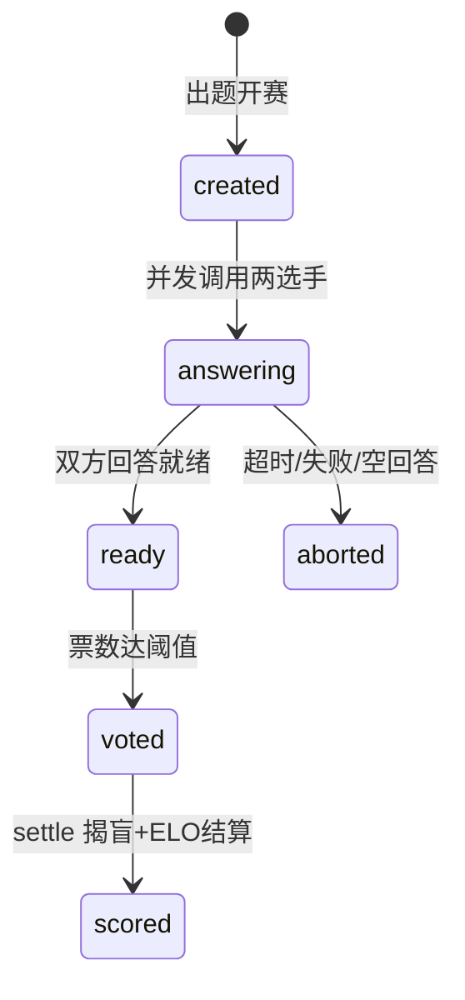

# arena-lite 参考规格（跟练项目 · 自查用）

> **怎么用**：这是**跟练项目** arena-lite 的参考规格。D06 请**先自己用 brainstorming/PM 角色产出你们组的 SPEC，再展开本文件对照**——重点不是抄，而是检查你写的验收标准够不够"可测"、范围有没有跑偏、边界漏没漏。跟练项目给足参考是刻意的（手把手阶段）；真正考你独立设计的是提交期的**自选项目**，那里没有参考答案。
> 范围 = M 级纵切面（US-1/US-2，集中期实做）；L 级功能仅列全景，供提交期示范"如何扩"。

## 1. 一句话与角色

课程版 Chatbot Arena：同一道题匿名呈现两个"选手"（模型）的回答，用户盲投，ELO 排行榜见分晓。
角色：**voter**（投票用户）｜ **admin**（选手与题目管理、结算）。M 阶段用户预置（无注册流程）。

## 2. 用户故事

**M 级（跟练实做）**
- US-1 发起对战并盲投：作为 voter，我要对一道题的两个匿名回答投票，以便公平比较模型。
- US-2 揭盲与排行榜：作为 voter，我要在结算后看到选手身份与最新 ELO 榜，以便知道谁更强。

**L 级全景（提交期示范，不在跟练范围）**：US-3 选手管理（admin CRUD）｜US-4 对战回放｜US-5 防刷治理｜US-6 智能体选手参赛。

## 3. 验收标准（全部"操作 → 预期输出"，可直接转测试）

### US-1

| # | 操作 | 预期 |
|---|---|---|
| AC-1.1 | admin 已预置选手 local-qwen 与 ds-online；`POST /battles {"prompt":"用一句话解释TDD"}` | `201` + `battle_id`；battle 状态 `created→answering`（并发调用两选手） |
| AC-1.2 | 双方回答就绪后 `GET /battles/{id}` | `200`；返回 `answer_a/answer_b`，**不含任何选手身份字段**；A/B 位随机（同一对选手多次开赛，位置分布不恒定） |
| AC-1.3 | 适配层超时或调用失败（**mock 注入**） | battle 状态 `aborted`；`GET` 明示 aborted 原因；不产生任何 ELO 变化 |
| AC-1.4 | voter 对 ready 状态 battle `POST /battles/{id}/vote {"choice":"A"}` | `200`；同一 voter 重复投同一 battle → `409`（幂等） |
| AC-1.5 | 对非 ready 状态（answering/aborted/scored）投票 | `409` + 状态说明 |

### US-2

| # | 操作 | 预期 |
|---|---|---|
| AC-2.1 | 投票数达阈值（默认 1，可配）后 `POST /battles/{id}/settle` | `200`；状态 `voted→scored`；响应含揭盲（双方身份、票数）与双方新 ELO |
| AC-2.2 | ELO 结算数值例：双方均 1500，A 胜，K=32 | A→**1516**，B→**1484**；平局各 +0/-0（期望差为 0 时）；分数下限 100 |
| AC-2.3 | `GET /leaderboard` | `200`；按 elo 降序；每行含 `name/elo/wins/losses/draws/battles` |
| AC-2.4 | 对已 scored 的 battle 重复 settle | `409`（状态机拒绝非法迁移） |

## 4. 错误路径清单（≥8，均须有测试）

①未认证请求→401；②不存在的 battle_id→404；③prompt 为空/超长→422；④两选手为同一 Contestant（自战）→422；⑤适配层超时→aborted（AC-1.3）；⑥适配层返回空串→按失败处理→aborted；⑦重复投票→409；⑧非法状态迁移（AC-1.5/2.4）→409；⑨选手 endpoint 不可达→aborted 并留错误信息。

## 5. 非目标（M 阶段明确不做）

无注册/找回密码（用户预置、简化 token）；无并发投票竞态处理（幂等即可）；无前端美化（能操作即可）；无 F6 回放 / F7 防刷 / F8 智能体选手；不评回答质量（系统零解析，人投票）。

## 6. 数据模型

```
User(id, name, role[voter|admin], token)
Contestant(id, name, endpoint, model, elo=1500)
Battle(id, prompt, contestant_a, contestant_b, answer_a, answer_b,
       status[created|answering|ready|aborted|voted|scored], created_at)
Vote(id, battle_id, voter_id, choice[A|B|tie])      # (battle_id, voter_id) 唯一
StatusEvent(id, battle_id, from, to, at)            # 若 ADR-2 选事件表方案
```

## 7. 状态机（非法迁移一律 409）



## 8. API 一览（M 级，6 个）

| 方法与路径 | 权限 | 成功 | 失败 |
|---|---|---|---|
| `POST /login` | 公开 | 200+token | 401 |
| `POST /battles` | admin | 201 | 401/422 |
| `GET /battles/{id}` | voter | 200（匿名视图） | 404 |
| `POST /battles/{id}/vote` | voter | 200 | 401/404/409 |
| `POST /battles/{id}/settle` | admin | 200（揭盲+ELO） | 409 |
| `GET /leaderboard` | voter | 200 | — |

## 9. 模块地图（≥6，依赖单向：api → domain/adapters → storage）

`api/`（FastAPI 路由与鉴权）｜`domain/elo.py`（纯函数：expected/update）｜`domain/pairing.py`（纯函数：A/B 随机位、自战校验、投票幂等判定）｜`domain/battle.py`（状态机）｜`adapters/`（模型适配层：Ollama 与 OpenAI 兼容双通道，统一 `ask(contestant, prompt, timeout) -> str`，**测试一律 mock 此接口**）｜`storage/`（SQLite 仓储 + 建表脚本）｜`client/`（对战页/榜单页，或 `battle`/`rank` 命令）。

## 10. ADR 种子（架构日 D07 用，学生须拍板 ≥1）

1. ELO 结算时机：投票即更新 vs settle 批量结算（并发一致性 vs 实时性）；
2. Battle 状态留痕：status 字段 vs StatusEvent 事件表（简单 vs 可审计）；
3. 适配层调用：同步并发（asyncio.gather）vs 任务队列（简单 vs 可扩展）。

## 11. 任务卡预拆参考（D09 冲刺用，8 张）

①建表脚本+仓储层｜②domain/elo（TDD）｜③domain/pairing（TDD）｜④适配层双通道+mock 接口｜⑤POST/GET battles（含状态机）｜⑥vote+幂等｜⑦settle+揭盲｜⑧leaderboard+客户端两页面。每卡 ≤2h，①→⑧ 大致拓扑有序，②③④ 可并行。

---
*本参考规格随复测走通骨架后按实测修订；你们组的 SPEC 与本文件的差异不判错，以"可测性、范围、边界完整性"三条自查。*
